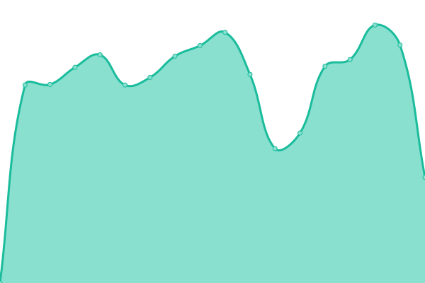
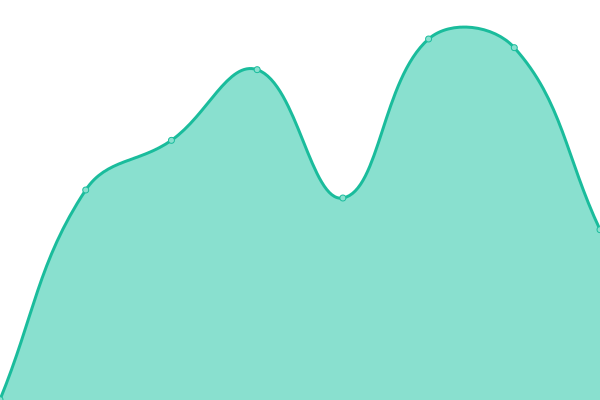

# [📈 Live Status](https://upptime.wpimplementer.com): <!--live status--> **🟩 All systems operational**

This repository contains the open-source uptime monitor and status page for [Stefano Tombolini](https://wpimplementer.com), powered by [Upptime](https://github.com/upptime/upptime).

With [Upptime](https://upptime.js.org), you can get your own unlimited and free uptime monitor and status page, powered entirely by a GitHub repository. We use [Issues](https://github.com/dedotombo/upptime/issues) as incident reports, [Actions](https://github.com/dedotombo/upptime/actions) as uptime monitors, and [Pages](https://upptime.wpimplementer.com) for the status page.

<!--start: status pages-->
<!-- This summary is generated by Upptime (https://github.com/upptime/upptime) -->
<!-- Do not edit this manually, your changes will be overwritten -->
<!-- prettier-ignore -->
| URL | Status | History | Response Time | Uptime |
| --- | ------ | ------- | ------------- | ------ |
|  [iPromptAI2](https://ipromptai2.sdtprogetti.com) | 🟩 Up | [i-prompt-ai-2.yml](https://github.com/dedotombo/upptime/commits/HEAD/history/i-prompt-ai-2.yml) | 

 195ms
     
 | 

<a href="https://upptime.sdtprogetti.com/history/i-prompt-ai-2">100.00%</a>
    

|  [SignoriCaffè](https://www.signoricaffe.it) | 🟩 Up | [signori-caffe.yml](https://github.com/dedotombo/upptime/commits/HEAD/history/signori-caffe.yml) | 

 1225ms
     
 | 

<a href="https://upptime.sdtprogetti.com/history/signori-caffe">100.00%</a>
    

|  [Caffè Clemente](https://www.caffecle.it) | 🟩 Up | [caffe-clemente.yml](https://github.com/dedotombo/upptime/commits/HEAD/history/caffe-clemente.yml) | 

 1422ms
     
 | 

<a href="https://upptime.sdtprogetti.com/history/caffe-clemente">100.00%</a>
    

|  [Macelleria Brocani 1921](https://macelleriabrocani.com) | 🟩 Up | [macelleria-brocani-1921.yml](https://github.com/dedotombo/upptime/commits/HEAD/history/macelleria-brocani-1921.yml) | 

 797ms
     
 | 

<a href="https://upptime.sdtprogetti.com/history/macelleria-brocani-1921">99.59%</a>
    

|  [Studio Legale Fabiola Tombolini](https://fabiolatombolini.law) | 🟩 Up | [studio-legale-fabiola-tombolini.yml](https://github.com/dedotombo/upptime/commits/HEAD/history/studio-legale-fabiola-tombolini.yml) | 

 229ms
     
 | 

<a href="https://upptime.sdtprogetti.com/history/studio-legale-fabiola-tombolini">97.07%</a>
    

|  [Abbadia Turismo](https://www.abbadiaturismo.it) | 🟩 Up | [abbadia-turismo.yml](https://github.com/dedotombo/upptime/commits/HEAD/history/abbadia-turismo.yml) | 

 2381ms
     
 | 

<a href="https://upptime.sdtprogetti.com/history/abbadia-turismo">100.00%</a>
    

|  [Autentica](https://shop.abbadiaturismo.it) | 🟩 Up | [autentica.yml](https://github.com/dedotombo/upptime/commits/HEAD/history/autentica.yml) | 

 1112ms
     
 | 

<a href="https://upptime.sdtprogetti.com/history/autentica">100.00%</a>
    

<!--end: status pages-->

[**Visit our status website →**](https://upptime.wpimplementer.com)

## 📄 License

- Powered by: [Upptime](https://github.com/upptime/upptime)
- Code: [MIT](./LICENSE) © [Anand Chowdhary](https://anandchowdhary.com), supported by [Pabio](https://pabio.com)
- Data in the `./history` directory: [Open Database License](https://opendatacommons.org/licenses/odbl/1-0/)
