# [📈 Live Status](https://upptime.wpimplementer.com): <!--live status--> **🟧 Partial outage**

This repository contains the open-source uptime monitor and status page for [Stefano Tombolini](https://wpimplementer.com), powered by [Upptime](https://github.com/upptime/upptime).

With [Upptime](https://upptime.js.org), you can get your own unlimited and free uptime monitor and status page, powered entirely by a GitHub repository. We use [Issues](https://github.com/dedotombo/upptime/issues) as incident reports, [Actions](https://github.com/dedotombo/upptime/actions) as uptime monitors, and [Pages](https://upptime.wpimplementer.com) for the status page.

<!--start: status pages-->
<!-- This summary is generated by Upptime (https://github.com/upptime/upptime) -->
<!-- Do not edit this manually, your changes will be overwritten -->
<!-- prettier-ignore -->
| URL | Status | History | Response Time | Uptime |
| --- | ------ | ------- | ------------- | ------ |
|  [iPromptAI2](https://ipromptai2.sdtprogetti.com) | 🟩 Up | [i-prompt-ai-2.yml](https://github.com/dedotombo/upptime/commits/HEAD/history/i-prompt-ai-2.yml) | 

 130ms
     
 | 

<a href="https://upptime.sdtprogetti.com/history/i-prompt-ai-2">100.00%</a>
    

|  [SignoriCaffè](https://www.signoricaffe.it) | 🟩 Up | [signori-caffe.yml](https://github.com/dedotombo/upptime/commits/HEAD/history/signori-caffe.yml) | 

 1279ms
     
 | 

<a href="https://upptime.sdtprogetti.com/history/signori-caffe">100.00%</a>
    

|  [Caffè Clemente](https://www.caffecle.it) | 🟩 Up | [caffe-clemente.yml](https://github.com/dedotombo/upptime/commits/HEAD/history/caffe-clemente.yml) | 

 1230ms
     
 | 

<a href="https://upptime.sdtprogetti.com/history/caffe-clemente">100.00%</a>
    

|  [Macelleria Brocani 1921](https://macelleriabrocani.com) | 🟩 Up | [macelleria-brocani-1921.yml](https://github.com/dedotombo/upptime/commits/HEAD/history/macelleria-brocani-1921.yml) | 

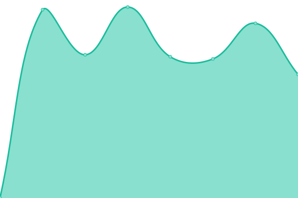 791ms
     
 | 

<a href="https://upptime.sdtprogetti.com/history/macelleria-brocani-1921">100.00%</a>
    

|  [Studio Legale Fabiola Tombolini](https://fabiolatombolini.law) | 🟩 Up | [studio-legale-fabiola-tombolini.yml](https://github.com/dedotombo/upptime/commits/HEAD/history/studio-legale-fabiola-tombolini.yml) | 

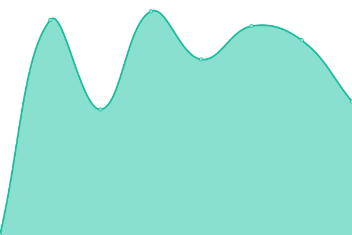 1020ms
     
 | 

<a href="https://upptime.sdtprogetti.com/history/studio-legale-fabiola-tombolini">100.00%</a>
    

|  [Informazione Scuola](https://www.informazionescuola.it) | 🟩 Up | [informazione-scuola.yml](https://github.com/dedotombo/upptime/commits/HEAD/history/informazione-scuola.yml) | 

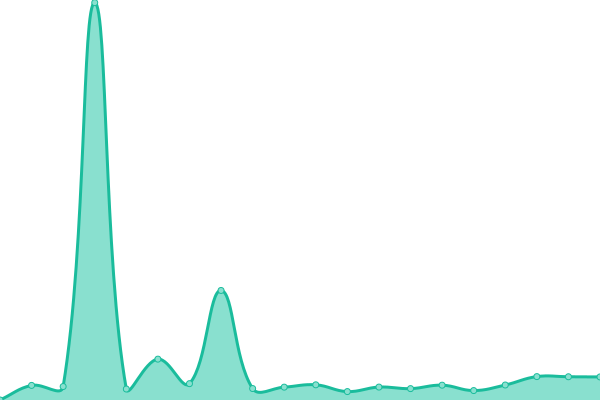 3124ms
     
 | 

<a href="https://upptime.sdtprogetti.com/history/informazione-scuola">99.79%</a>
    

|  [Vita da Cani](https://vitadacani.info) | 🟩 Up | [vita-da-cani.yml](https://github.com/dedotombo/upptime/commits/HEAD/history/vita-da-cani.yml) | 

 862ms
     
 | 

<a href="https://upptime.sdtprogetti.com/history/vita-da-cani">100.00%</a>
    

|  [Association of Italian Chiropractors 50th Anniversary](https://www.aic50.it) | 🟩 Up | [association-of-italian-chiropractors-50th-anniversary.yml](https://github.com/dedotombo/upptime/commits/HEAD/history/association-of-italian-chiropractors-50th-anniversary.yml) | 

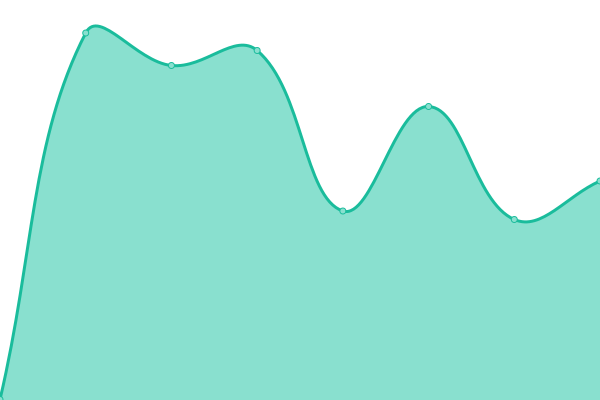 508ms
     
 | 

<a href="https://upptime.sdtprogetti.com/history/association-of-italian-chiropractors-50th-anniversary">100.00%</a>
    

|  [AIC Servizi srl](https://aicservizi.it) | 🟩 Up | [aic-servizi-srl.yml](https://github.com/dedotombo/upptime/commits/HEAD/history/aic-servizi-srl.yml) | 

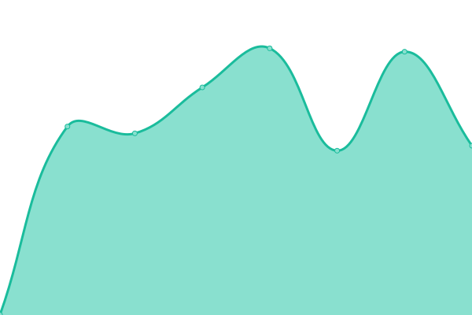 806ms
     
 | 

<a href="https://upptime.sdtprogetti.com/history/aic-servizi-srl">100.00%</a>
    

|  [Alessandro Archibugi & Figlio srl](https://archibugi.eu) | 🟩 Up | [alessandro-archibugi-and-figlio-srl.yml](https://github.com/dedotombo/upptime/commits/HEAD/history/alessandro-archibugi-and-figlio-srl.yml) | 

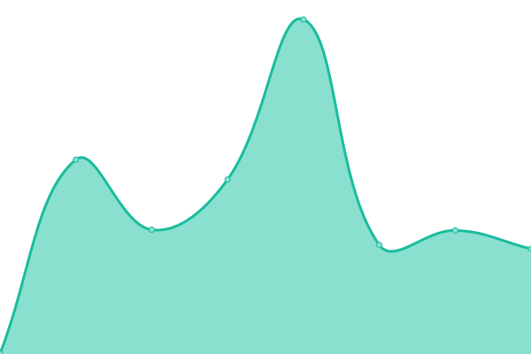 447ms
     
 | 

<a href="https://upptime.sdtprogetti.com/history/alessandro-archibugi-and-figlio-srl">100.00%</a>
    

|  [Chiropratica e Salute](https://chiropraticaesalute.it) | 🟩 Up | [chiropratica-e-salute.yml](https://github.com/dedotombo/upptime/commits/HEAD/history/chiropratica-e-salute.yml) | 

 768ms
     
 | 

<a href="https://upptime.sdtprogetti.com/history/chiropratica-e-salute">100.00%</a>
    

|  [Chiropratica Today](https://chiropraticatoday.it) | 🟩 Up | [chiropratica-today.yml](https://github.com/dedotombo/upptime/commits/HEAD/history/chiropratica-today.yml) | 

 954ms
     
 | 

<a href="https://upptime.sdtprogetti.com/history/chiropratica-today">100.00%</a>
    

|  [Claudio Zara ortopedia](https://claudiozara.com) | 🟩 Up | [claudio-zara-ortopedia.yml](https://github.com/dedotombo/upptime/commits/HEAD/history/claudio-zara-ortopedia.yml) | 

 1411ms
     
 | 

<a href="https://upptime.sdtprogetti.com/history/claudio-zara-ortopedia">100.00%</a>
    

|  [Colorkid](https://colorkid.it) | 🟩 Up | [colorkid.yml](https://github.com/dedotombo/upptime/commits/HEAD/history/colorkid.yml) | 

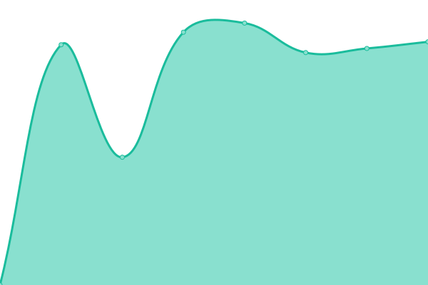 5348ms
     
 | 

<a href="https://upptime.sdtprogetti.com/history/colorkid">100.00%</a>
    

|  [FESTIVAL sotto il Conero](https://www.festivalsottoilconero.it) | 🟩 Up | [festival-sotto-il-conero.yml](https://github.com/dedotombo/upptime/commits/HEAD/history/festival-sotto-il-conero.yml) | 

 1015ms
     
 | 

<a href="https://upptime.sdtprogetti.com/history/festival-sotto-il-conero">100.00%</a>
    

|  [Fullcolor Design](https://fullcolordesign.it) | 🟥 Down | [fullcolor-design.yml](https://github.com/dedotombo/upptime/commits/HEAD/history/fullcolor-design.yml) | 

 1656ms
     
 | 

<a href="https://upptime.sdtprogetti.com/history/fullcolor-design">45.86%</a>
    

|  [Garantisco Io](https://www.garantiscoio.com) | 🟩 Up | [garantisco-io.yml](https://github.com/dedotombo/upptime/commits/HEAD/history/garantisco-io.yml) | 

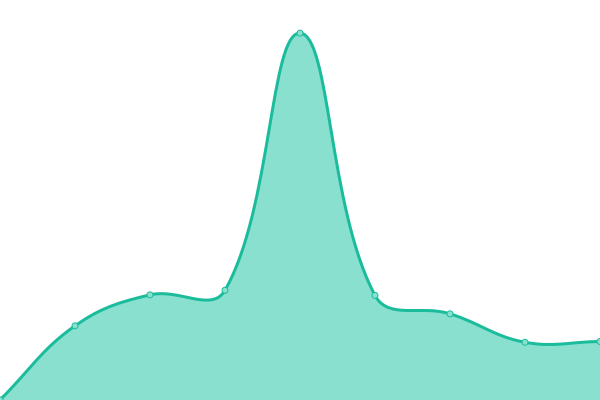 771ms
     
 | 

<a href="https://upptime.sdtprogetti.com/history/garantisco-io">100.00%</a>
    

|  [Giacinto Facchetti Official Website](https://giacintofacchetti.org) | 🟩 Up | [giacinto-facchetti-official-website.yml](https://github.com/dedotombo/upptime/commits/HEAD/history/giacinto-facchetti-official-website.yml) | 

 674ms
     
 | 

<a href="https://upptime.sdtprogetti.com/history/giacinto-facchetti-official-website">100.00%</a>
    

|  [Gigi Simoni Official Website](https://gigisimoni.it) | 🟩 Up | [gigi-simoni-official-website.yml](https://github.com/dedotombo/upptime/commits/HEAD/history/gigi-simoni-official-website.yml) | 

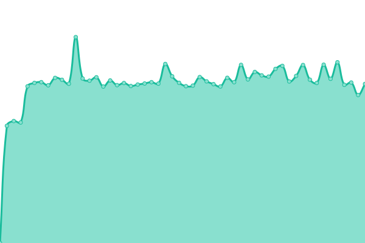 1715ms
     
 | 

<a href="https://upptime.sdtprogetti.com/history/gigi-simoni-official-website">100.00%</a>
    

|  [Greison Anatomy](https://greisonanatomy.com) | 🟩 Up | [greison-anatomy.yml](https://github.com/dedotombo/upptime/commits/HEAD/history/greison-anatomy.yml) | 

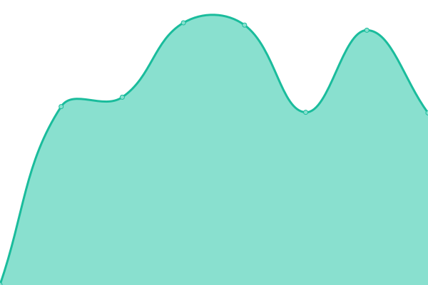 751ms
     
 | 

<a href="https://upptime.sdtprogetti.com/history/greison-anatomy">100.00%</a>
    

|  [Ristorante Marcello Portonovo](https://illaghetto.com) | 🟩 Up | [ristorante-marcello-portonovo.yml](https://github.com/dedotombo/upptime/commits/HEAD/history/ristorante-marcello-portonovo.yml) | 

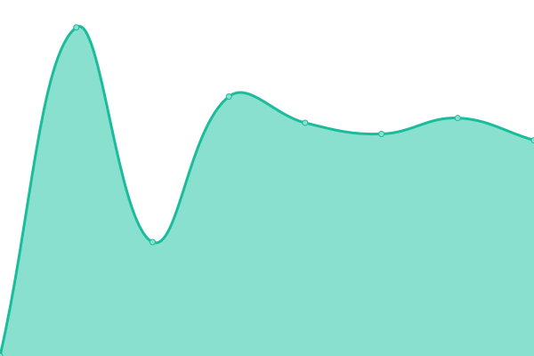 3467ms
     
 | 

<a href="https://upptime.sdtprogetti.com/history/ristorante-marcello-portonovo">100.00%</a>
    

|  [Informazione Podcast](https://www.informazionepodcast.it) | 🟩 Up | [informazione-podcast.yml](https://github.com/dedotombo/upptime/commits/HEAD/history/informazione-podcast.yml) | 

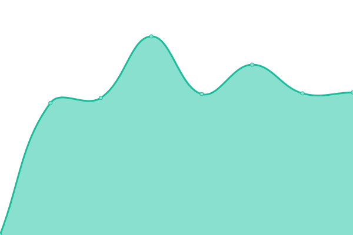 3770ms
     
 | 

<a href="https://upptime.sdtprogetti.com/history/informazione-podcast">100.00%</a>
    

|  [Ristorante La Pagodina Numana](https://lapagodina.it) | 🟩 Up | [ristorante-la-pagodina-numana.yml](https://github.com/dedotombo/upptime/commits/HEAD/history/ristorante-la-pagodina-numana.yml) | 

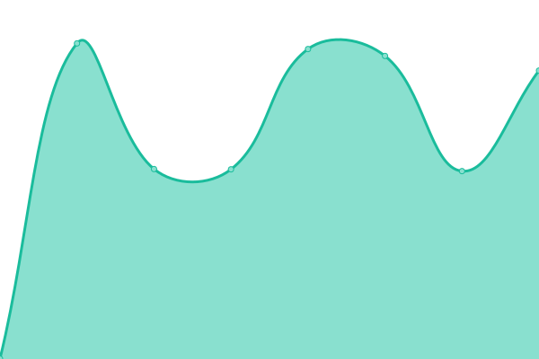 794ms
     
 | 

<a href="https://upptime.sdtprogetti.com/history/ristorante-la-pagodina-numana">100.00%</a>
    

|  [marcotraferri.info](https://marcotraferri.info) | 🟩 Up | [marcotraferri-info.yml](https://github.com/dedotombo/upptime/commits/HEAD/history/marcotraferri-info.yml) | 

 2495ms
     
 | 

<a href="https://upptime.sdtprogetti.com/history/marcotraferri-info">100.00%</a>
    

|  [Marco Traferri Editore](https://marcotraferrieditore.com) | 🟩 Up | [marco-traferri-editore.yml](https://github.com/dedotombo/upptime/commits/HEAD/history/marco-traferri-editore.yml) | 

 3158ms
     
 | 

<a href="https://upptime.sdtprogetti.com/history/marco-traferri-editore">100.00%</a>
    

|  [Marybloom](https://marybloom.it) | 🟩 Up | [marybloom.yml](https://github.com/dedotombo/upptime/commits/HEAD/history/marybloom.yml) | 

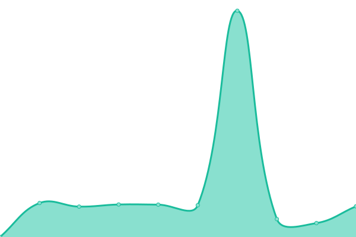 3381ms
     
 | 

<a href="https://upptime.sdtprogetti.com/history/marybloom">100.00%</a>
    

|  [Mete d'Italia](https://www.meteditalia.it) | 🟩 Up | [mete-d-italia.yml](https://github.com/dedotombo/upptime/commits/HEAD/history/mete-d-italia.yml) | 

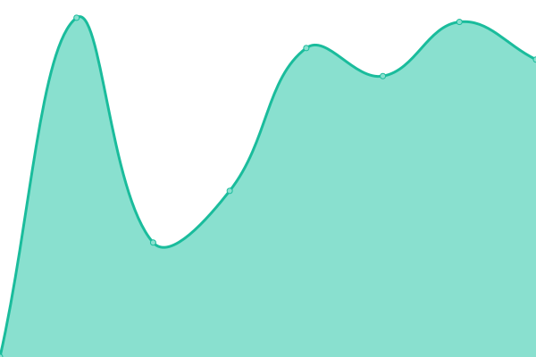 2416ms
     
 | 

<a href="https://upptime.sdtprogetti.com/history/mete-d-italia">100.00%</a>
    

|  [Osteopatia Magazine](https://osteopatiamagazine.com) | 🟩 Up | [osteopatia-magazine.yml](https://github.com/dedotombo/upptime/commits/HEAD/history/osteopatia-magazine.yml) | 

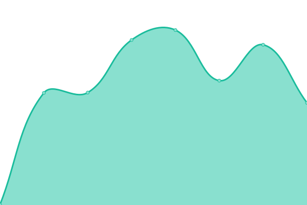 388ms
     
 | 

<a href="https://upptime.sdtprogetti.com/history/osteopatia-magazine">100.00%</a>
    

|  [Ottica Pergolesi Store](https://otticapergolesistore.com) | 🟩 Up | [ottica-pergolesi-store.yml](https://github.com/dedotombo/upptime/commits/HEAD/history/ottica-pergolesi-store.yml) | 

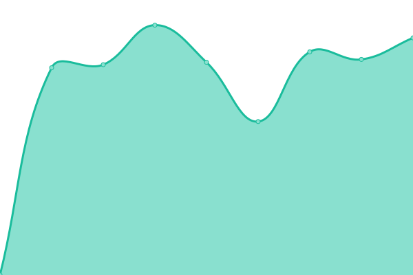 2404ms
     
 | 

<a href="https://upptime.sdtprogetti.com/history/ottica-pergolesi-store">100.00%</a>
    

|  [Pesci Fuor d'Acqua](https://pescifuordacqua.it) | 🟥 Down | [pesci-fuor-d-acqua.yml](https://github.com/dedotombo/upptime/commits/HEAD/history/pesci-fuor-d-acqua.yml) | 

 2296ms
     
 | 

<a href="https://upptime.sdtprogetti.com/history/pesci-fuor-d-acqua">99.99%</a>
    

|  [PESMOD](https://pesmod.it) | 🟩 Up | [pesmod.yml](https://github.com/dedotombo/upptime/commits/HEAD/history/pesmod.yml) | 

 1006ms
     
 | 

<a href="https://upptime.sdtprogetti.com/history/pesmod">100.00%</a>
    

|  [Piergiorgio Ramello Photography](https://piergiorgioramello.com) | 🟩 Up | [piergiorgio-ramello-photography.yml](https://github.com/dedotombo/upptime/commits/HEAD/history/piergiorgio-ramello-photography.yml) | 

 2089ms
     
 | 

<a href="https://upptime.sdtprogetti.com/history/piergiorgio-ramello-photography">100.00%</a>
    

|  [Riparazioni Online](https://www.riparazionionline.com) | 🟩 Up | [riparazioni-online.yml](https://github.com/dedotombo/upptime/commits/HEAD/history/riparazioni-online.yml) | 

 3150ms
     
 | 

<a href="https://upptime.sdtprogetti.com/history/riparazioni-online">100.00%</a>
    

|  [Salute Today](https://salutetoday.info) | 🟩 Up | [salute-today.yml](https://github.com/dedotombo/upptime/commits/HEAD/history/salute-today.yml) | 

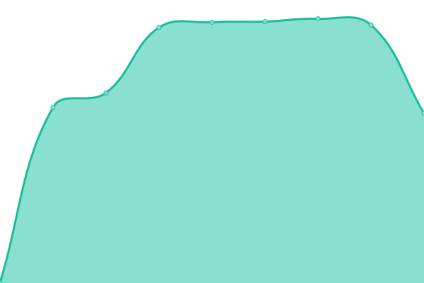 1151ms
     
 | 

<a href="https://upptime.sdtprogetti.com/history/salute-today">100.00%</a>
    

|  [Sarai Belo Te](https://saraibelote.com) | 🟩 Up | [sarai-belo-te.yml](https://github.com/dedotombo/upptime/commits/HEAD/history/sarai-belo-te.yml) | 

 4864ms
     
 | 

<a href="https://upptime.sdtprogetti.com/history/sarai-belo-te">99.79%</a>
    

|  [Sfoglina Simonetta](https://sfoglinasimonetta.it) | 🟩 Up | [sfoglina-simonetta.yml](https://github.com/dedotombo/upptime/commits/HEAD/history/sfoglina-simonetta.yml) | 

 5193ms
     
 | 

<a href="https://upptime.sdtprogetti.com/history/sfoglina-simonetta">100.00%</a>
    

|  [Stop & Go Ancona](https://stopgoancona.com) | 🟩 Up | [stop-and-go-ancona.yml](https://github.com/dedotombo/upptime/commits/HEAD/history/stop-and-go-ancona.yml) | 

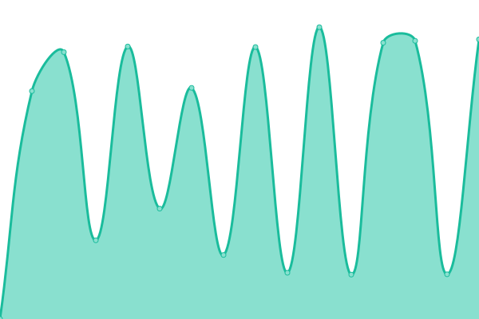 3038ms
     
 | 

<a href="https://upptime.sdtprogetti.com/history/stop-and-go-ancona">100.00%</a>
    

|  [Studio Chiropratico Schultz](https://studio-chiropratico-schultz.it) | 🟩 Up | [studio-chiropratico-schultz.yml](https://github.com/dedotombo/upptime/commits/HEAD/history/studio-chiropratico-schultz.yml) | 

 4031ms
     
 | 

<a href="https://upptime.sdtprogetti.com/history/studio-chiropratico-schultz">100.00%</a>
    

|  [Texcolor](https://texcolor.it) | 🟩 Up | [texcolor.yml](https://github.com/dedotombo/upptime/commits/HEAD/history/texcolor.yml) | 

 1836ms
     
 | 

<a href="https://upptime.sdtprogetti.com/history/texcolor">100.00%</a>
    

|  [Un biglietto per Gaia](https://unbigliettopergaia.it) | 🟩 Up | [un-biglietto-per-gaia.yml](https://github.com/dedotombo/upptime/commits/HEAD/history/un-biglietto-per-gaia.yml) | 

 2952ms
     
 | 

<a href="https://upptime.sdtprogetti.com/history/un-biglietto-per-gaia">100.00%</a>
    

|  [Valentina Ottaviani](https://valentinaottaviani.com) | 🟥 Down | [valentina-ottaviani.yml](https://github.com/dedotombo/upptime/commits/HEAD/history/valentina-ottaviani.yml) | 

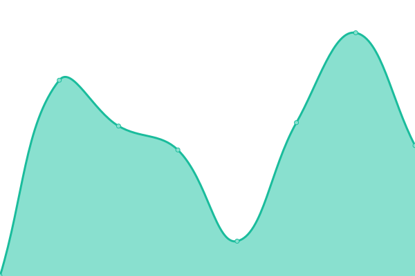 418ms
     
 | 

<a href="https://upptime.sdtprogetti.com/history/valentina-ottaviani">0.00%</a>
    

<!--end: status pages-->

[**Visit our status website →**](https://upptime.wpimplementer.com)

## 📄 License

- Powered by: [Upptime](https://github.com/upptime/upptime)
- Code: [MIT](./LICENSE) © [Anand Chowdhary](https://anandchowdhary.com), supported by [Pabio](https://pabio.com)
- Data in the `./history` directory: [Open Database License](https://opendatacommons.org/licenses/odbl/1-0/)
